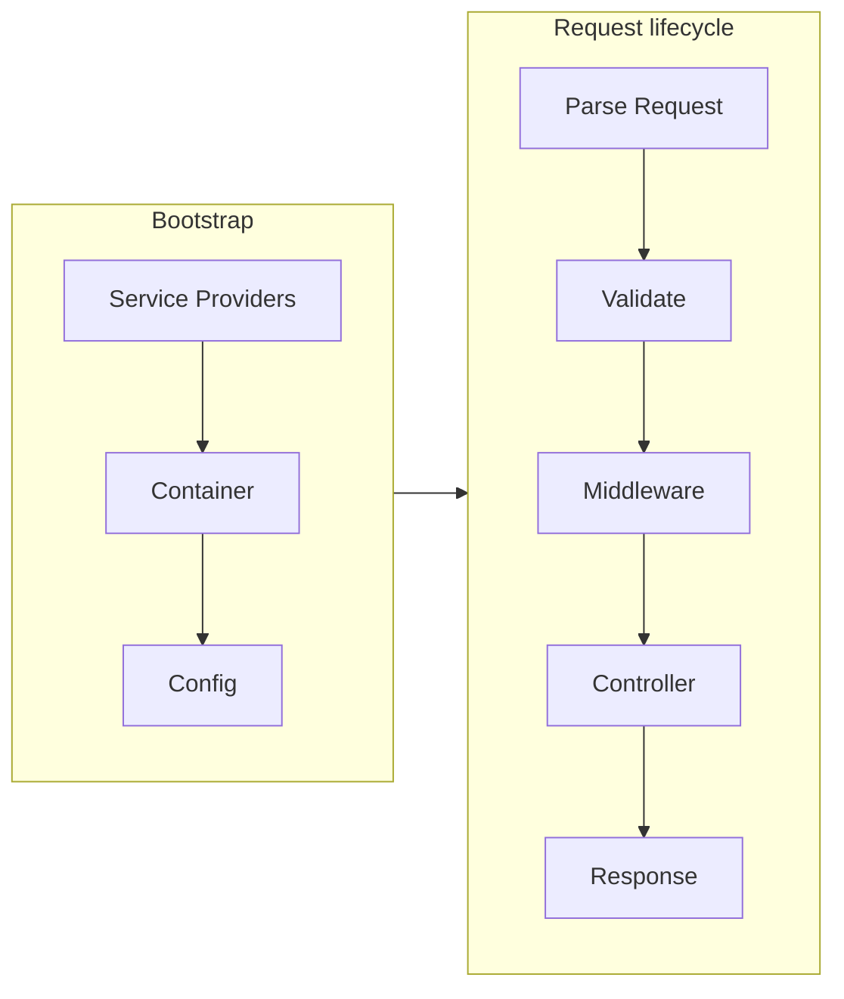

# Ziravel Roadmap and Goals (through v0.5)

## Current state (baseline)

The codebase today provides:

- **Foundation**: [App.zig](src/framework/Foundation/App.zig) (bootstrap, `listen`), [Server.zig](src/framework/Foundation/Server.zig) (TCP accept, synchronous per-request handling)
- **HTTP**: [Request.zig](src/framework/Http/Request.zig) (method, URL, headers; no query/body parsing), [Response.zig](src/framework/Http/Response.zig) (status, headers, body, `json()`)
- **Routing**: [Router.zig](src/framework/Routing/Router.zig) (get/post/put/delete/patch/options/head, exact path match only), [Route.zig](src/framework/Routing/Route.zig) (url, method, handler)
- **Flow**: `App.capture` → parse Request → resolve Route → call handler(Request, Response) → write response. No container, middleware, or controller abstraction; handlers are inline closures.

Package version in [build.zig.zon](build.zig.zon) is `0.0.0`; module name in build is `zigavel`.

---

## Goals by version

### v0.1 — Stabilize current (immediate)

- Treat current feature set as v0.1.
- **Routing**: Return proper HTTP 404 when no route matches and 405 when method does not match (optional: `Allow` header).
- **Request**: Parse query string into a simple map (e.g. `?foo=bar`) and expose on `Request`; keep body parsing out of scope for this version.
- **Response**: Ensure `Content-Length` and error responses are consistent; no new APIs required.
- **Docs**: Add a minimal README (what Ziravel is, how to run, link to .cursorrules for philosophy).
- **Version**: Set `version = "0.1.0"` in `build.zig.zon` and document in README or CHANGELOG.

**Outcome**: Clear "v0.1" baseline with correct 404/405 and query string support.

---

### v0.2 — Route parameters and path parsing

- **Route params**: Support path parameters (e.g. `/users/:id`, `/posts/:slug`) and capture segments; match one concrete pattern per route (no regex).
- **Resolver**: When resolving, parse path and fill a `params` map (or similar) on `Request` (or a context object passed to handler) so handlers can read `id`, `slug`, etc.
- **API**: Keep `router.get("/users/:id", handler)` style; document that path must match exactly except for parameter segments.
- **Optional**: Route names and/or reverse routing (generate URL from route name + params) as a stretch goal; otherwise defer to v0.3+.

**Outcome**: Handlers can use dynamic path segments without parsing URLs manually.

---

### v0.3 — Middleware pipeline and Controller abstraction

- **Middleware**: Define a Middleware type (e.g. `*const fn (Request, Response, next: *const fn () void) void` or a small struct with `handle`). App runs a pipeline: parse request → run middleware stack → resolve route → run route middleware (if any) → dispatch to handler.
- **Order**: Router → global middleware → route → (optional) per-route middleware → handler. Middleware can short-circuit (e.g. send 401 and not call next).
- **Controller**: Introduce a Controller abstraction: a type with action methods. Router registers routes that dispatch to a controller + action (e.g. `UserController.index`). Request (and optionally a minimal "container" for dependencies) is passed into the action; controller remains thin, no business logic in routing.
- **Allocator**: Keep using a single default allocator for now; document that request/response lifecycle is synchronous and scoped to the connection.

**Outcome**: Laravel-like flow (Router → Middleware → Controller → Response) with thin controllers and no business logic in route definitions.

---

### v0.4 — Service Container and Service Providers

- **Container**: Minimal Service Container: register bindings (type/name → factory or singleton), resolve by type/name. No full Laravel feature set; focus on "register once, resolve per request or per app" for things like Logger, Config, or future DB.
- **Providers**: Service Provider concept: `register` (bind into container) and `boot` (run after all register). App holds a list of providers and runs register then boot at startup.
- **App bootstrap**: `App.init` (or similar) accepts router + list of providers; before `listen`, app runs providers and optionally builds a request-scoped container (or at least an app-scoped one). Route handlers and controllers receive Request/Response; container can be accessed from App or from Request if you add a minimal "app" reference.
- **Config**: Simple config registry (key/value or typed keys) loaded from env or a small config module; config values can be registered in container and injected where needed.

**Outcome**: Extensible bootstrap (Providers), shared dependencies (Container), and env-based config without hard-coding.

---

### v0.5 — Validation and request lifecycle (release target)

- **Validation**: Validation layer for request data (query, path params, and optionally body). Define rules (required, type, length, etc.); validate before controller runs; attach errors to Request or a dedicated ValidationResult and allow controller to return 422 with error payload.
- **Request lifecycle**: Document and stabilize: Parse → Validate (if rules present) → Middleware → Controller → Response. Ensure one place where validation errors are turned into responses (e.g. 422 JSON).
- **Body parsing**: For v0.5, add simple JSON body parsing on Request (e.g. `request.json()` or `request.bodyAsJson()`) so validation and controllers can use JSON input.
- **Error handling**: Centralized error handling: unhandled errors in middleware/controller result in a single place that maps to 500 (and optionally logs); validation errors stay 422.
- **Version and docs**: Set version to `0.5.0` in `build.zig.zon`. Update README with architecture diagram (Router → Middleware → Validation → Controller → Response), list of features, and "getting started" for a small JSON API.

**Outcome**: v0.5 is a usable "Laravel-lite" for small APIs: routing, params, middleware, controllers, container, providers, config, validation, and clear error/response behavior. No database, queue, or events yet; those remain post–v0.5.

---

## Out of scope until after v0.5

- Database / ORM / query builder / migrations  
- Events and listeners  
- Queue / jobs  
- CLI (Artisan-like)  
- Sessions / auth (beyond middleware returning 401)  
- Full Facade system (optional later)

---

## Summary diagram (target v0.5)

---

## Suggested file/structure evolution (reference)

- **v0.1**: Same layout; add README, bump version.
- **v0.2**: Route param parsing in Router/Route; `Request.path_params` or similar.
- **v0.3**: `Middleware.zig`, `Pipeline.zig` (or middleware run in App), `Controller.zig` (base type + dispatch).
- **v0.4**: `Container.zig`, `ServiceProvider.zig`, `Config.zig`; App owns container and runs providers.
- **v0.5**: `Validation.zig`, body parsing in Request, centralized error handling in App or Kernel; optional `Kernel.zig` for HTTP-specific bootstrap.
